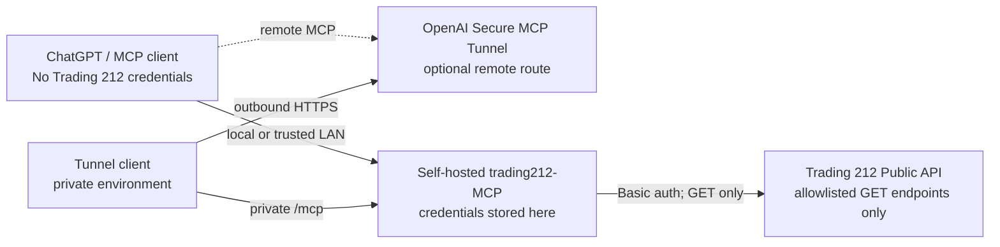

# Trading 212 MCP Server: Read-Only

[](https://github.com/Nerfagol/trading212-MCP/actions/workflows/ci.yml) [](pyproject.toml) [](LICENSE)

A self-hosted Trading 212 MCP server that gives ChatGPT and other Model Context Protocol
(MCP) clients structured access to an Invest account or Stocks ISA.
Trading 212 API credentials exist only on your server: the model never receives
the Trading 212 API key or secret.

**Read-only by construction · API keys stay on your server · No trading actions · Docker & QNAP ready**

The implementation cannot buy, sell, place, create, cancel, update, or modify orders.
It contains only six explicitly allowlisted Trading 212 `GET` endpoints and no generic HTTP client.



The tunnel is optional. When used, its connection is initiated outbound from the
private environment; otherwise an MCP client can connect directly over loopback
or a trusted LAN. In both cases, credentials remain inside the self-hosted server.

## 📊 What this gives you

- A current account overview with currency, value, cost, and profit/loss data
- Available cash, cash reserved for orders, and cash held in pies
- Open positions, quantities, prices, current values, and unrealized P/L
- Pending orders plus paginated order history
- Deposits, withdrawals, fees, transfers, and paid dividends
- Structured responses that an MCP client can use directly in conversation

## 💬 Example questions

Once connected, you can ask:

> Give me an account summary.

> How much cash is available to trade?

> Show my open positions and unrealized profit or loss.

> Do I have any pending orders?

> Show my recent transactions.

> What dividends have been paid?

These questions map directly to implemented read operations. The server does
not provide financial advice or perform trades.

## 🔒 Read-only by design

The client contains only six allowlisted Trading 212 `GET` endpoints. There is
no generic HTTP request method and no code for buying, selling, creating,
placing, cancelling, modifying, or updating an order.

MCP annotations also mark every tool read-only, but the enforced boundary is
the GET-only client implementation. Review the complete [security design](docs/security.md)
and its automated write-surface checks.

## ✅ What to expect

- **Eight read-only tools** returning structured account data
- **Demo and Live support**, with Demo recommended for the first run
- **Paginated history**, returned one bounded page per tool call
- **No frontend**: this is not a browser dashboard; your MCP client is the interface
- **Independent health checking** that does not contact Trading 212
- **Private output**: account responses contain sensitive financial data and
  should not be copied into logs, issues, or public chats

## 🚀 Choose your deployment

| Route | Best for | Network exposure | Entry point |
| --- | --- | --- | --- |
| Local Docker | Evaluation and development | Loopback only | `docker compose` |
| QNAP LAN-only | Trusted devices on your LAN | Fixed NAS LAN address | `deploy.sh mcp` |
| QNAP + OpenAI Secure MCP Tunnel | ChatGPT and supported OpenAI products | Outbound HTTPS; no inbound public port | `deploy.sh tunnel` |

## 🐳 Quick start: local Docker

Use the immutable release tag for a reproducible local deployment. Keep the host
port on loopback unless you have deliberately configured a trusted LAN binding.

```bash
mkdir trading212-mcp && cd trading212-mcp
curl --fail --remote-name https://raw.githubusercontent.com/Nerfagol/trading212-MCP/v0.1.0/.env.example
cp .env.example .env
chmod 600 .env
# Edit .env. Start with a Demo key and T212_ENV=demo.
docker pull ghcr.io/nerfagol/trading212-mcp:0.1.0
docker run -d --name trading212-mcp --restart unless-stopped --init \
  --read-only --tmpfs /tmp:size=16m,mode=1777 \
  --cap-drop ALL --security-opt no-new-privileges \
  --env-file .env -p 127.0.0.1:8000:8000 \
  ghcr.io/nerfagol/trading212-mcp:0.1.0
curl --fail --silent http://127.0.0.1:8000/health
```

Expected: `{"status":"ok"}`. MCP endpoint: `http://127.0.0.1:8000/mcp`.

## 🛠️ Build from source

Prerequisites: Git, Docker Engine, Docker Compose v2, and Trading 212 Demo API
credentials.

```bash
git clone https://github.com/Nerfagol/trading212-MCP.git
cd trading212-MCP
cp .env.example .env
chmod 600 .env
# Edit .env. Start with a Demo key and T212_ENV=demo.
docker compose up -d --build
curl --fail --silent http://127.0.0.1:8000/health
```

Expected response: `{"status":"ok"}`

- MCP: `http://127.0.0.1:8000/mcp`
- Health: `http://127.0.0.1:8000/health`

See [Configuration](docs/configuration.md) for credentials, environment
variables, Demo versus Live, running from source, and network settings.

## 🗄️ Deploy on QNAP

Place the project in a persistent Container Station directory, create the
protected root `.env`, and bind port 8000 to the NAS's fixed LAN address rather
than `0.0.0.0`. Then run:

```sh
./deploy/qnap/deploy.sh mcp
./deploy/qnap/verify.sh mcp
```

The verifier checks health, LAN binding, and the exact tool surface without
calling a financial tool. Follow the [QNAP deployment guide](docs/qnap-deployment.md)
for preparation, safe updates, rollback, and QNAP-specific Docker paths.

## 🔐 Connect ChatGPT securely

The optional OpenAI Secure MCP Tunnel runs separately on QNAP and reaches the
LAN-only MCP endpoint through an outbound HTTPS connection. Port 8000 remains
LAN-only, the tunnel admin listener remains loopback-only on port 18080, and no
router forwarding or public reverse proxy is required.

```sh
./deploy/qnap/tunnel/prepare-secrets.sh init
# Populate the protected files without putting values in shell history.
./deploy/qnap/tunnel/prepare-secrets.sh lock
./deploy/qnap/deploy.sh tunnel
./deploy/qnap/verify.sh tunnel
```

Follow the [Secure MCP Tunnel guide](docs/secure-mcp-tunnel.md) for prerequisites,
protected-file formats, verification, and ChatGPT Web connection steps.

## 🧰 MCP tools

| Tool | What it reads |
| --- | --- |
| `get_account` | Account currency, value, cash, cost, and profit/loss summary |
| `get_cash` | Available, reserved, and pie cash |
| `get_portfolio` | Every currently open position |
| `get_position` | One position by exact Trading 212 ticker |
| `get_orders` | Current pending orders and execution state |
| `get_order_history` | Historical orders and fills |
| `get_transactions` | Deposits, withdrawals, fees, and transfers |
| `get_dividends` | Paid dividends |

See the [MCP tool reference](docs/mcp-tools.md) for arguments, Trading 212
endpoints, permissions, response formats, pagination, and safe errors. Use the
official MCP Inspector to verify local discovery by following the
[development guide](docs/development.md).

## 📚 Documentation

- [Configuration](docs/configuration.md): credentials, environments, local setup, and networking
- [MCP tool reference](docs/mcp-tools.md): tools, endpoints, arguments, and responses
- [Security design](docs/security.md): GET-only boundary, architecture, and runtime controls
- [Development and verification](docs/development.md): tests, linting, builds, and MCP Inspector
- [Release and Registry readiness](docs/releasing.md): versioning, GHCR, and metadata validation
- [Directory submission material](docs/directory-submissions.md): prepared summaries and current submission routes
- [QNAP deployment](docs/qnap-deployment.md): Container Station deployment and operations
- [Secure MCP Tunnel](docs/secure-mcp-tunnel.md): private ChatGPT connectivity
- [QNAP command reference](deploy/qnap/README.md): sanitized operational scripts

## Official resources

- [Trading 212 Public API](https://docs.trading212.com/api)
- [Trading 212 agent-skills repository](https://github.com/trading212-labs/agent-skills)
- [Model Context Protocol Python SDK](https://github.com/modelcontextprotocol/python-sdk)
- [Official MCP Registry](https://modelcontextprotocol.io/registry/about)
- [OpenAI Secure MCP Tunnel](https://developers.openai.com/api/docs/guides/secure-mcp-tunnels)
- [Connect an MCP server to ChatGPT](https://developers.openai.com/plugins/deploy/connect-chatgpt)

The official Trading 212 agent-skills repository informed the API research for
this project. It includes trading actions. This project does not import or depend on agent-skills
and intentionally implements only allowlisted GET operations.

## Disclaimer

This independent project is not affiliated with or endorsed by Trading 212.
Trading 212 names are used only to describe interoperability. This software is
not financial advice. Review its source, permissions, and network boundary
before connecting an account.

## License

Licensed under the [MIT License](LICENSE).
